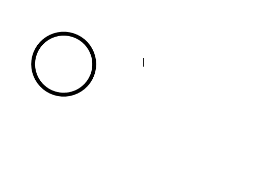

# maximum-bipartite-matching

Here is a very cool image. 

And you are going to like it. 

\documentclass{article}
\usepackage{tikz}
\usetikzlibrary{chains,fit,shapes}
\usetikzlibrary{calc}
\begin{document}
\definecolor{myblue}{RGB}{80,80,160}
\definecolor{mygreen}{RGB}{80,160,80}
\begin{tikzpicture}[thick,
  every node/.style={draw,circle},
  ssnode/.style={fill=myblue},
  fsnode/.style={fill=mygreen},
  every fit/.style={ellipse,draw,inner sep=-1pt,text width=1.75cm},
  ->,shorten >= 2pt,shorten <= 2pt
]

% the vertices of Slots
\begin{scope}[start chain=going below,node distance=1.5mm]
\foreach \i in {1,2,...,8}
  \node[ssnode,on chain] (s\i) [label=left: \i] {};
\end{scope}

% the vertices of Flights
\begin{scope}[xshift=4cm,yshift=-0.5cm,start chain=going below,node distance=1.5mm]
\foreach \i in {2,5,6,7,8}
  \node[fsnode,on chain] (f\i) [label=right: $f_{\i}$] {};
\end{scope}

% the set Slots
\node [myblue,fit=(s1) (s8),label=above:$Slots$] {};
% the set Flights
\node [mygreen,fit=(f2) (f8),label=above:$Flights$] {};

% the edges

\draw[red] (s2) -- (f2);
\draw (s5.45) -- (f5.220);
\draw ([yshift=-25mm]s6) -- ([yshift=-25mm]f6);
\draw (s7) -- (f7);
\draw (s8) -- (f8);
\draw[<->] ($(f2)+(-0.15,0.15)$) -- (s1);
\draw[<->] (f5) -- (s3);
\draw (f6) -- (s5);
\draw (f7) -- (s5);
\draw (f8) -- (s7);

\end{tikzpicture}
\end{document}