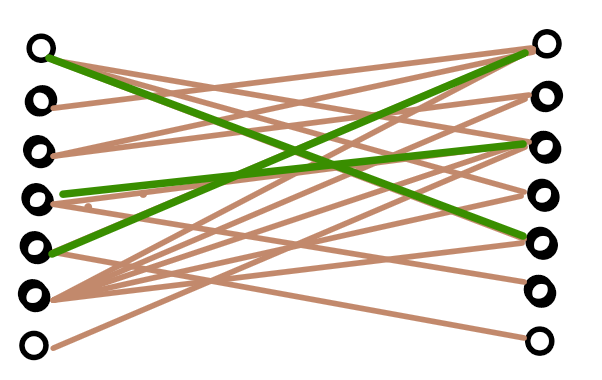
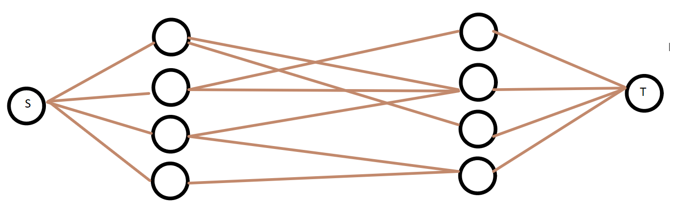
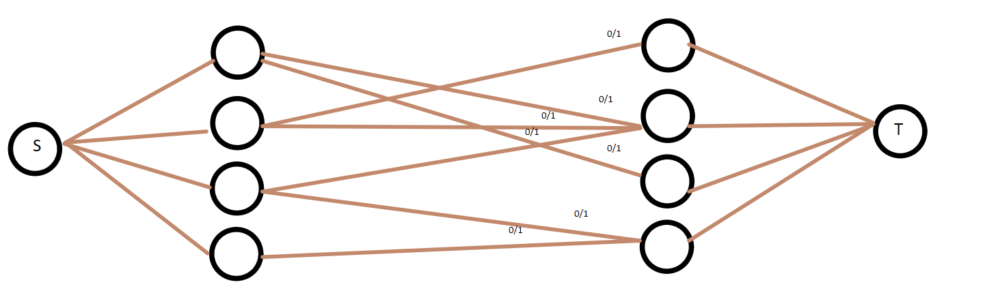
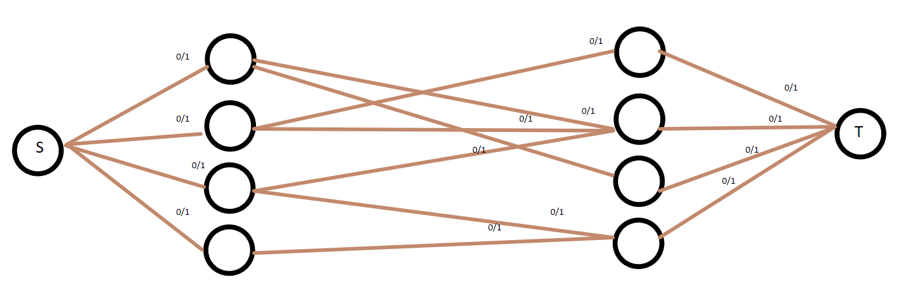

# Maximum-bipartite-matching

### The problem. 

Given a bipartite graph  G = (V,E) , we want to find a set of edges in such a way that no two edges share an endpoint. Here is an illustration of what we would have to do. 

This is an example of a random bipartite graph.

For the given bipartite , the following edges do not share an endpoint. 

Looking for edges with the property just described is trivial, but looking 
for the **MAXIMUM** number of edges with such property is not trivial. 

### How to solve the problem ?

The approach to solve this problem will be the Ford Fulkerson algorithm.
The very first step will be to add the source and sink nodes as well as assigning direction to the edges which is ilustrated
in the following picture. 

The very first question that we have to ask, now that we have a source, 
a sink and the rest of the edges, how are we going to get assign the 
capacities. 

Initially, we will set the capacities for the edges that we want to 
maximize as 1. Which would look as follows. 

The next thing that we have to assign would be the capacities for  the edges that are connected to the source. Initially we would be tempted to 
assign those capacities as 1 too. 

**The question that arises is, what happens if we do not assign those capacities as 1 ?**

To begin with, nothing would really happen in terms of the Ford Fulkerson algorithm it would work as normal, but in terms of a real world application that would have very interesting meanings. For example, imagine that our bipartite graph represents the correspondence between job seekers and part-time jobs, every person might be able to take multiple part time jobs, and the final result of the Ford Fulkerson algorithm would output multiple jobs for every job seeker. 

In any case, for simplicity (specially on the implementation) we are going to set the capacity for the edges connected to the source as 1. 

Similarly, for the edges connected to the sink we could are not forced to 
use capacities of value 1 and once again that could have interesting interpretations in terms of real world applications. 

The final network flow graph would look as follows. 

